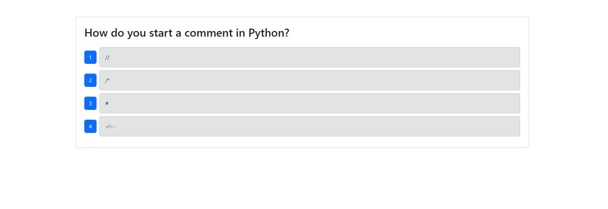

# github-actions   
  
  ## Description 

  This repo is equipped with cypress tests to ensure functionality of an example quiz application before permitting a merge to the main branch and a GitHub action to automatically deploy anything pushed into the main branch.

  ## Table of Contents

  - [Usage](#usage)
  - [License](#license)
  - [Dev](#dev)

  ## Usage

  Any edits made to the repo will be immedaitely pushed to render.

  ### Mock-Up
  

  ## License
  This application is covered under the [MIT](https://opensource.org/licenses/MIT) license.
  

  ## Dev

  Try the deployed [application](https://github-actions-vmbp.onrender.com/).

  Check out the [repo](https://github.com/michaelhdavies/github-actions/).

  Developed by [Michael Henry Davies](https://github.com/michaelhdavies/).

  [Back to Top](#description)
  
  